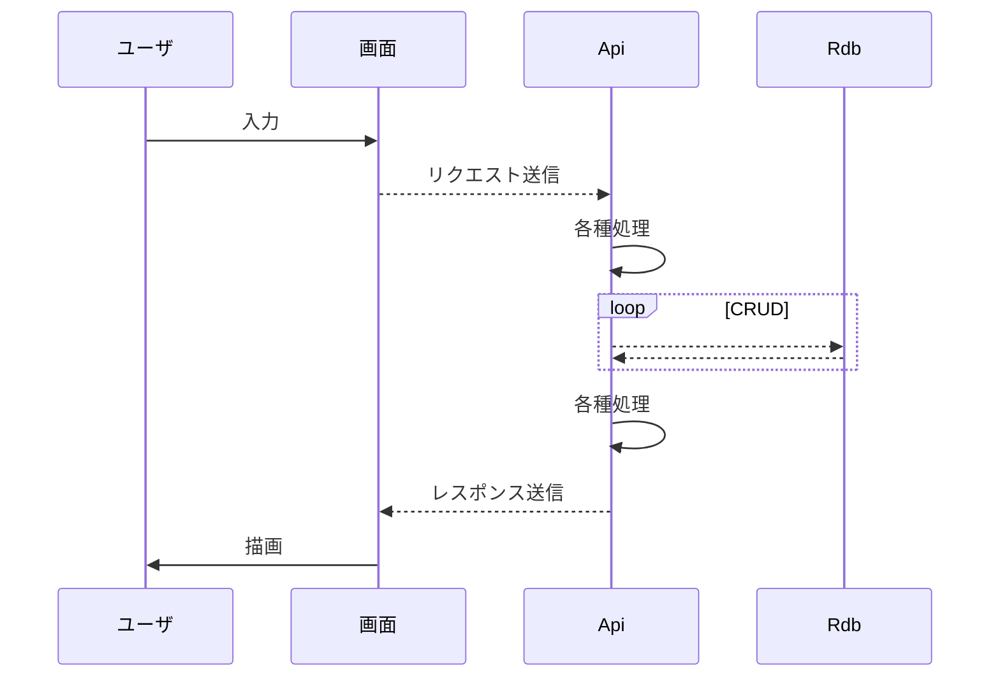
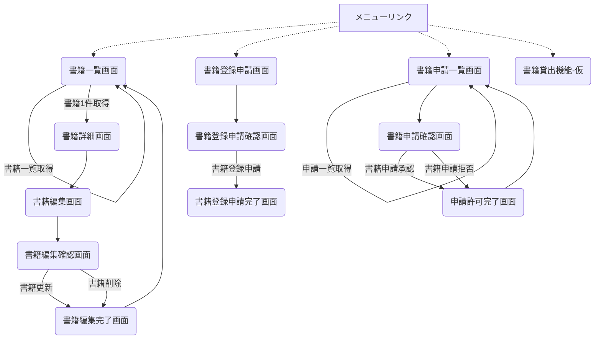

# 成果物：社内書籍管理システム(方式設計)
====

## ユーザ
+ 画面を介してApiを実行する。

## 画面
+ 作成対象から外すとするも、WebApiとのIFは必ず定義する。

## Api
+ Java(jdk10)にて実装する。
+ アプリケーション・サーバーはSpringBootの内蔵Tomcatを使用するとする。
+ 同時アクセスは最大４人を想定するとする。(社内で使用するので)
+ "RESTful API"の考え方を踏襲するとする。
+ 入力値については検証対象とする。

## Rdb
+ Postgres10にて管理する。
+ "database"には当システム以外からは呼ばれない。
+ プログラムから呼び出す際は「program」(仮)ユーザーからアクセスする。
+ リリース用とテスト用を用意する。ただし開発用はdockerコンテナを利用する。
+ 具体的なテーブル内容については開発時に決める。
+ データベース・アクセスはJavaの部品にて実現する。
+ ドメイン機能を使用する。
+ シーケンスを使用する。
+ 排他方法については"更新回数"を使用する。

## シーケンス図

下記は [Mermaid](https://mermaidjs.github.io/) を使用しています。  
GoogleChromのアプリにて描画しているものをスクショしています。  
Macでのスクショ方法は「shift + command + 4」です。  

### クライアント<->サーバー

### 画面遷移図

