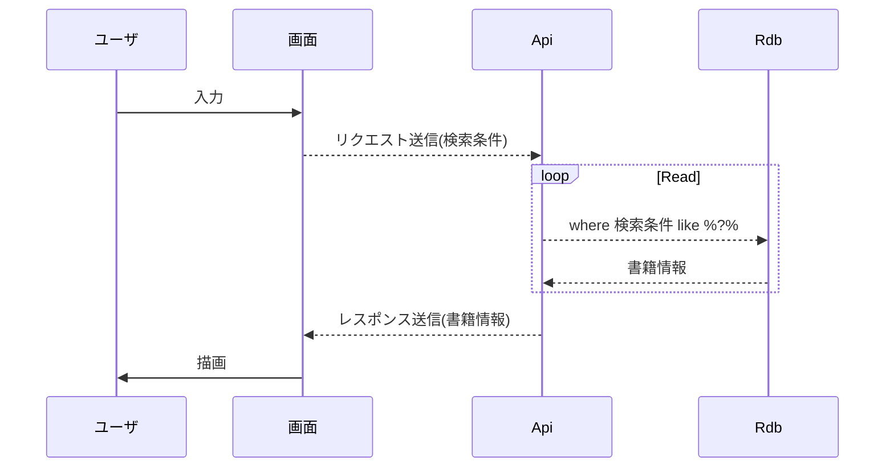

# 成果物：書籍一覧取得(詳細設計書)
==================

## 処理概要
検索条件を指定し、書籍一覧を取得する。  
ソート、ページングには対応しない。

### シーケンス図

## 処理内容
1. 入力チェック
2. 書籍情報取得(Rdb問い合わせ)
3. レスポンス設定

## 入出力  

### Request
|名称|必須|min|max|
|---|---|---|---|
|書籍ID||||
|ISBN||||
|書籍名称||||

### Response
+ 書籍ID
+ 更新回数
+ ISBN
+ 書籍名称

## 処理詳細

### 1. 入力チェック
_Request_に対して入力チェックを実施する。  
エラーが発生した場合、発生箇所/内容を返却する。  

+ 書籍ID
+ ISBN
+ 書籍名称

### 2. 書籍情報取得(Rdb問い合わせ)
_Request_から検索クエリを生成する。  
検索クエリを使用してRdb問い合わせする。  

### 3. レスポンス設定
2.で取得したEntity(Stream)を_Response_(配列)に変換する。  