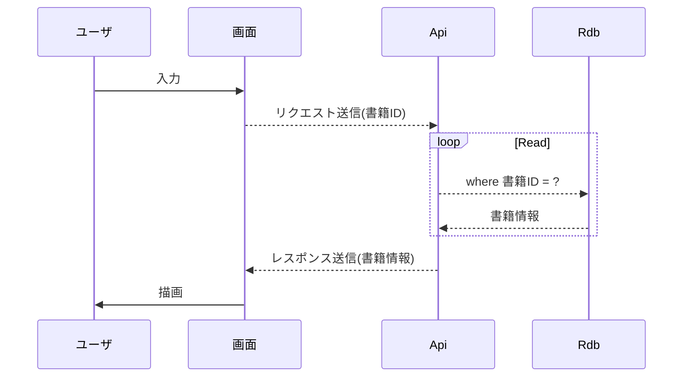

# 成果物：書籍詳細取得(詳細設計書)
====

## 処理概要
1. 書籍情報取得(Rdb問い合わせ)
2. レスポンス設定

## シーケンス図

下記は [Mermaid](https://mermaidjs.github.io/) を使用しています。  
GoogleChromのアプリにて描画しているものをスクショしています。  
Macでのスクショ方法は「shift + command + 4」です。  

## Input
+ 書籍ID

### validation
+ 書籍ID

## Output
+ 書籍ID
+ 更新日時
+ ISBN
+ 書籍名称