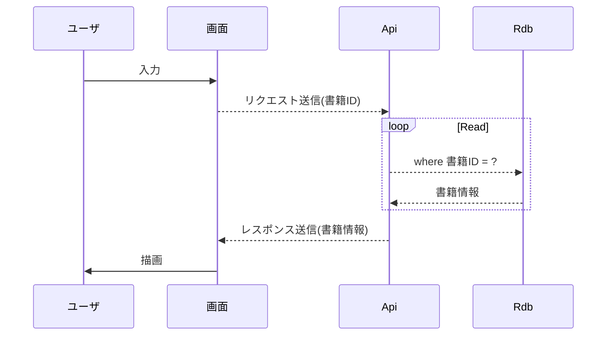

# 成果物：書籍詳細取得(詳細設計書)
==================

## 処理概要
書籍IDを条件に、書籍情報を1件取得する。  
返却される更新回数は排他制御に使用する。

### シーケンス図

## 処理内容
1. 入力チェック
2. 書籍情報取得(Rdb問い合わせ)
3. レスポンス設定

## 入出力  

### Request
|名称|必須|min|max|
|---|---|---|---|
|書籍ID||||

### Response
+ 書籍ID
+ 更新回数
+ ISBN
+ 書籍名称

## 処理詳細

### 1. 入力チェック
リクエストに対して入力チェックを実施する。
エラーが発生した場合、発生箇所/内容を返却する。

+ 書籍ID

### 2. 書籍情報取得(Rdb問い合わせ)
リクエスト内容から検索クエリを生成する。
検索クエリを使用してRdb問い合わせする。

### 3. レスポンス設定
Entityからレスポンスに変換する。